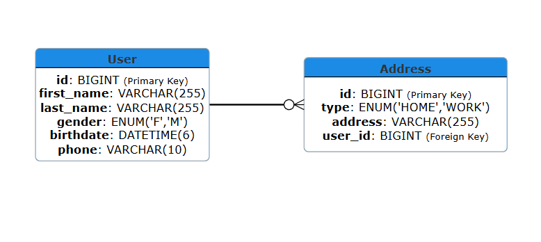
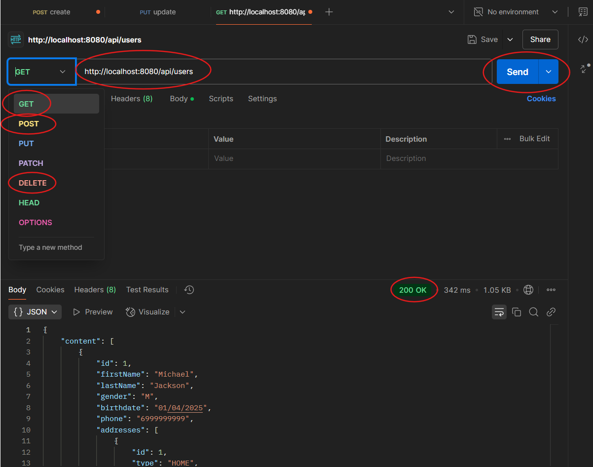
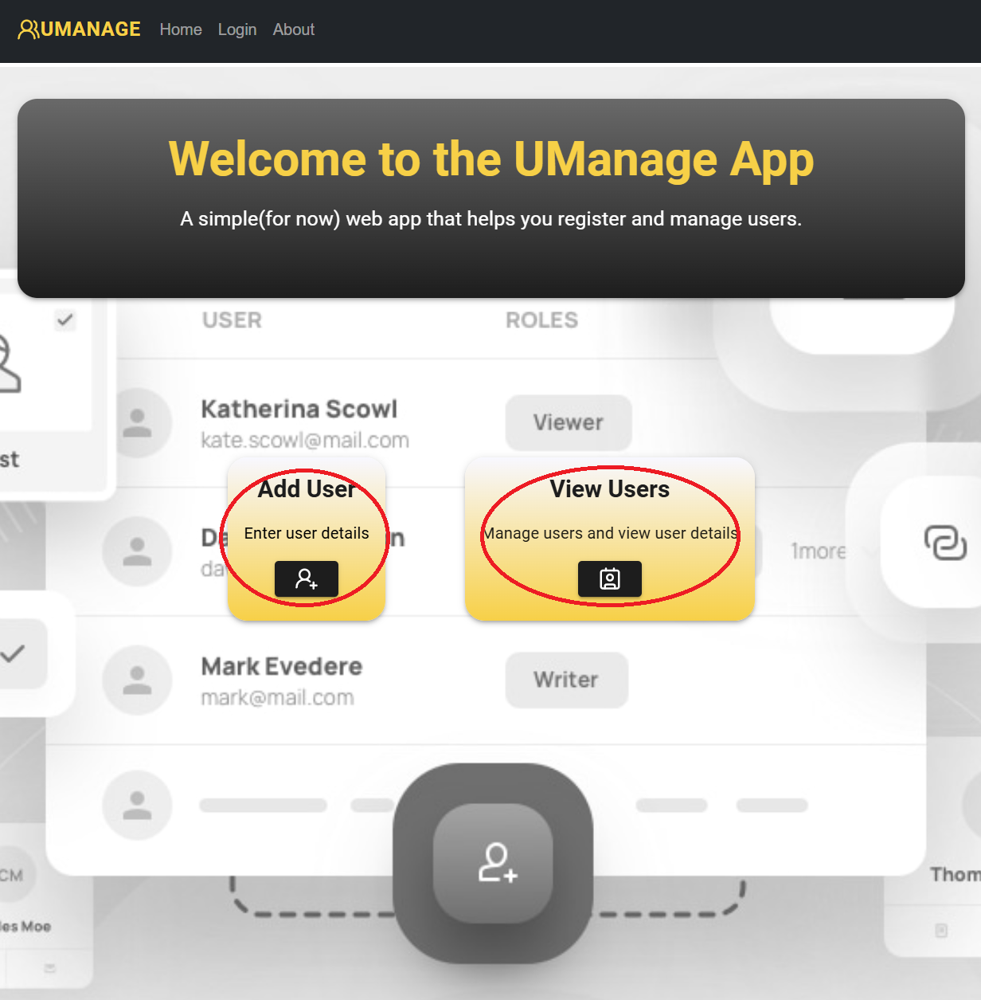
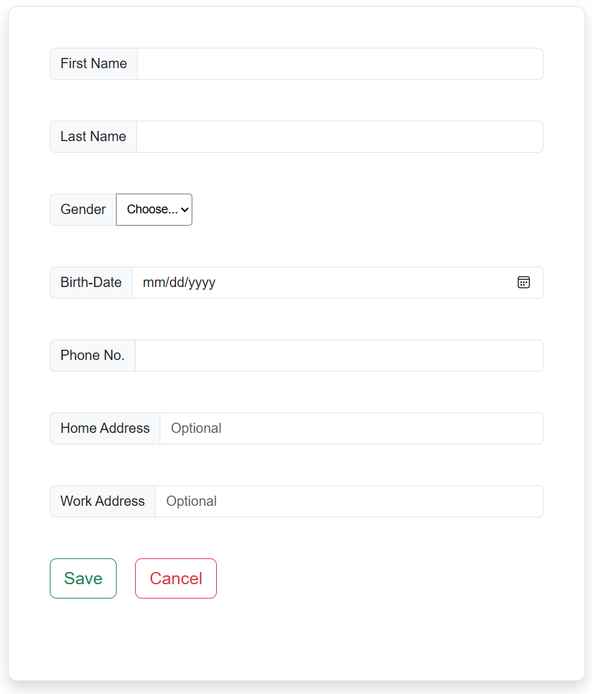
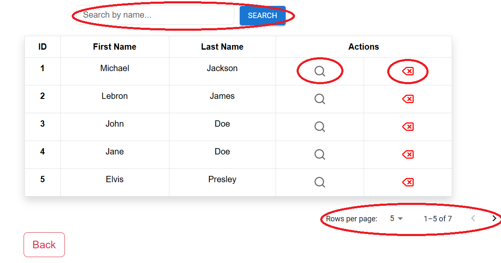

# UManage Web App

## Overview - Introduction

UManage is a full-stack web application that can be used to register, manage and monitor a catalog of users. This project serves as a hands-on experience in designing and building a scalable, modular and fully functional app, using modern web development tools and frameworks, while also exploring and implementing the best practices that can be applied.

## Project Structure

```
.
├── README.md
├── doc-pics
├── docker-compose.yml
├── usersapp
│   ├── Dockerfile
│   ├── HELP.md
│   ├── mvnw
│   ├── mvnw.cmd
│   ├── pom.xml
│   ├── src
│   └── target
└── usersapp-front
    ├── Dockerfile
    ├── README.md
    ├── build
    ├── node_modules
    ├── package-lock.json
    ├── package.json
    ├── public
    └── src
```

## Key Technologies

- MySQL (Database): A reliable, widely-used relational database for structured data storage, with support for robust queries and indexing.

- Java Spring Boot (Backend): A powerful, established Java framework for building production-ready applications with Java, offering robust backend support and data management.

  - Maven: A build automation tool used for dependency management, compiling code, running tests, and packaging the app into deployable artifacts.
  - Spring Boot Starter Web: Simplifies the setup of RESTful web services and web applications.
  - Spring Data JPA: A part of the Spring Data project that makes it easy to implement JPA-based repositories.
  - Hibernate (JPA Provider): An object-relational mapping (ORM) library for mapping an object-oriented domain model to a relational database.
  - Spring Boot Starter Data JPA: A starter for using Spring Data JPA with Hibernate.
  - RESTful APIs: Representational state transfer (REST) APIs for structured and efficient communication between the frontend and backend.

- React (Frontend): A modern JavaScript library for building user interfaces, providing a responsive and interactive experience.

  - React Router: A routing library for React that enables navigation and URL handling in single-page applications.
  - Axios: A promise-based HTTP client for making API requests.
  - Material UI: A popular React UI framework with customizable, accessible components.
  - Bootstrap: A CSS framework that adds responsive design and layout utilities.

- Docker: A platform for containerizing applications and services, ensuring consistency across development, testing, and production environments.

## Database Structure

The project’s database design includes one table for the User and its details and one table for the Addresses that are associated with the Users.

**User Table**
| Column Name | Data Type | Description |
| :---: | :---: | :---: |
| id | BIGINT(Primary Key) | Unique identifier for each user |
| first_name | VARCHAR(255) | First name of the user |
| last_name | VARCHAR(255) | Last name of the user |
| gender | ENUM('F','M') | Gender of the user |
| birthdate | DATETIME(6) | Birthdate of the user |
| phone | VARCHAR(10) | Phone No. of the user |

**Address Table**
| Column Name | Data Type | Description |
| :---: | :---: | :---: |
| id | BIGINT(Primary Key) | Unique identifier for each user |
| address | VARCHAR(255) | Address text |
| type | ENUM('HOME','WORK') | Address type |
| user_id | BIGINT(Foreign key) | User ID associated with the address |

**ER Diagram**


## Backend

**Maven Dependencies**:

- Spring Boot Starter Web:

```xml
<dependency>
		<groupId>org.springframework.boot</groupId>
		<artifactId>spring-boot-starter-web</artifactId>
</dependency>
```

- Spring Boot Starter Data JPA:

```xml
<dependency>
	    <groupId>org.springframework.boot</groupId>
		<artifactId>spring-boot-starter-data-jpa</artifactId>
</dependency>
```

- MySQL Connector/J:

```xml
<dependency>
		<groupId>com.mysql</groupId>
		<artifactId>mysql-connector-j</artifactId>
		<scope>runtime</scope>
</dependency>
```

- Spring Boot Starter Validation:

```xml
<dependency>
		<groupId>org.springframework.boot</groupId>
		<artifactId>spring-boot-starter-validation</artifactId>
</dependency>
```

- Spring Boot Starter Test:

```xml
<dependency>
		<groupId>org.springframework.boot</groupId>
		<artifactId>spring-boot-starter-test</artifactId>
		<scope>test</scope>
</dependency>
```

\
**Database Configuration**:

The project is configured to connect to a MySQL database with the following properties:

```properties
spring.datasource.url=jdbc:mysql://localhost:3306/usersapp
spring.datasource.username= YOUR_USERNAME
spring.datasource.password=YOUR_PASSWORD
spring.datasource.driverClassName=com.mysql.cj.jdbc.Driver
spring.jpa.show-sql=true
spring.jpa.hibernate.ddl-auto=update
```

\
**Backend Implementation**

1. User Entity:

   - User Model
     \
     The User Model represents the structure of user data in the database.

   ```java
   //User Entity
   @Entity
   @Table(name = "users")
   public class User {
   //User attributes, getters, setters, constructors
   }
   ```

   - User Repository
     \
     The repository layer manages data access to the user entity using Spring Data JPA.

   ```java
   //User Repo
   @Repository
   public interface UserRepo extends JpaRepository<User, Long> {
   }
   ```

   - User Service Interface
     \
     The Service Interface contains the methods and business logic that interact with the repository to perform CRUD operations on data.

   ```java
   //User Service
   public interface UserService {
    //Service methods declaration
   }
   ```

   - User Service Implementation
     \
     The Implementation of the service methods and logic.

   ```java
   //User Service Impl
   @Service
   public class UserServiceImpl implements UserService {
    //Service methods implementation
   }
   ```

   - User Controller
     \
     The Controller handles HTTP requests and routes them to the Service layer.

   ```java
   //User Controller
   @CrossOrigin("http://localhost:3000")
   @RestController
   @RequestMapping("/api/users")
   public class UserController {
    //Controller functions
   }
   ```

2. Address Entity:

   - Address Model
     \
     The Address Model represents the structure of address data in the database.

   ```java
   //Address Entity
   @Entity
   @Table(name = "addresses")
   public class Address {
    //Address attributes, getters, setters and constructors
   }
   ```

   - Address Repository
     \
     The repository layer manages data access to the address entity using Spring Data JPA.

   ```java
   //Address Repository
   @Repository
   public interface AddressRepo extends JpaRepository<Address, Long> {
   }
   ```

## (Optional) Postman Testing

Postman was used to test and validate all backend API endpoints. It allowed for quick inspection of request and response payloads, status codes and error handling. This helped ensure the backend behaves as expected before moving on with the integration of the frontend.



## Frontend - User Interface

The frontend was built with a focus on simplicity, clarity, and ease of use. React was chosen for its component-based structure, making it easier to organize features like forms, user lists, and navigation.
Basic features include:

1. Home Page:



2. Navbar:


3. Form for adding users:



4. List for managing users with pagination and search function:



## (Optional) Docker

Docker was added to containerize both the backend and frontend, making the project easier to run and deploy consistently across different environments. By defining Dockerfiles for each part of the stack and managing services through docker-compose, the entire app can be launched with a single command. This setup helps streamline development, testing, and potential deployment to cloud platforms or production servers.

1. Enviroment Variables:

- Backend: Update the application properties

```properties
spring.datasource.url=jdbc:mysql://${MYSQL_HOST:localhost}:${MYSQL_PORT:3306}/usersapp
spring.datasource.username=${MYSQL_USER:YOUR_USERNAME}
spring.datasource.password=${MYSQL_PASSWORD:YOUR_PASSWORD}
```

- Frontend: Create a `.env` file

```properties
REACT_APP_API_URL=http://localhost:8080
```

2. Dockerfiles:

- Backend:

```docker
FROM openjdk:24-jdk-slim
WORKDIR /app
COPY target/usersapp-0.0.1-SNAPSHOT.jar app.jar
EXPOSE 8080
ENTRYPOINT ["java", "-jar", "app.jar"]
```

- Frontend:

```docker
FROM node:23-slim
WORKDIR /app
COPY package*.json ./
RUN npm install
COPY . .
RUN npm run build
RUN npm install -g serve
EXPOSE 3000
CMD ["serve", "-s", "build", "-1", "3000"]
```

3. Docker-compose:

```docker
services:
  mysql:
    image: mysql:8.0
    container_name: mysqldb
    restart: always
    volumes:
      - mysql_data:/var/lib/mysql

    environment:
      MYSQL_ROOT_PASSWORD: root
      MYSQL_DATABASE: usersapp
      MYSQL_USER: user
      MYSQL_PASSWORD: user

    ports:
      - "3308:3306"
    networks:
      - app-network

  backend:
    build: ./usersapp
    container_name: backend
    depends_on:
      - mysql
    ports:
      - "8080:8080"
    environment:
      MYSQL_HOST: mysql
      MYSQL_USER: user
      MYSQL_PASSWORD: user
      MYSQL_PORT: 3306
    networks:
      - app-network

  frontend:
    build: ./usersapp-front
    container_name: frontend
    depends_on:
      - backend
    ports:
      - "3000:3000"
    working_dir: /app
    command: [ "npx", "serve", "-s", "build", "-l", "3000" ]
    environment:
      - REACT_APP_API_URL=http://backend:8080
    networks:
      - app-network

volumes:
  mysql_data:


networks:
  app-network:
```

## Future Improvements - Additions

1. Implementation of DTOs:
   Restructure the backend by introducing Data Transfer Objects (DTOs) to separate the internal data models from the data sent over the network. This helps improve security by exposing only necessary fields and reduces payload size, while also making the backend codebase cleaner and easier to maintain.

2. Login Function:
   Implement a secure login system with JWT-based authentication to restrict access to certain endpoints. This will allow user-specific data to be retrieved and managed safely, setting the foundation for user sessions and roles (e.g., admin vs. standard users).

3. More UI features - tweaks
